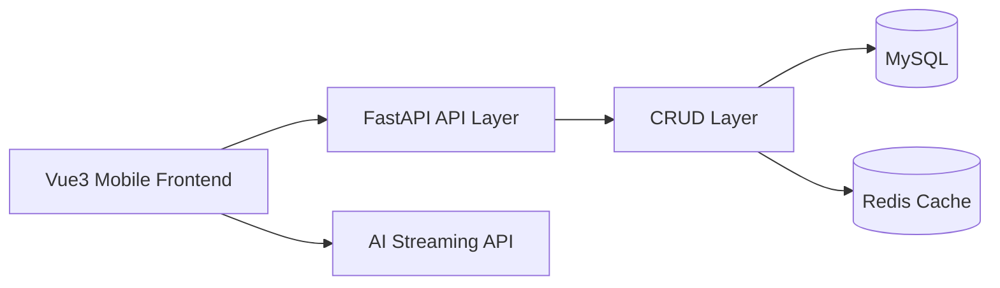

# 智讯 AI

> 一个面向移动端场景打造的 AI 智能资讯平台，集新闻浏览、个性化阅读、用户体系、收藏历史与 AI 问答于一体的前后端分离全栈项目。

- 基于 `Vue3 + FastAPI + MySQL + Redis` 的前后端分离 AI 资讯平台，覆盖资讯浏览、用户登录注册、收藏历史、个人中心与 AI 问答等核心业务闭环。
- 设计并实现新闻分类、列表、详情、相关推荐、阅读记录、收藏管理等接口，采用 `SQLAlchemy AsyncSession` 构建异步数据访问层，并引入 Redis 对热点资讯数据进行缓存优化。
- 前端基于 `Vant + Pinia + Vue Router + Vue I18n` 构建移动端 H5 应用，支持分页加载、下拉刷新、主题切换、国际化与状态持久化，具备较完整的产品化体验。

## 项目简介

- 前端负责资讯消费体验，覆盖首页分类切换、下拉刷新、分页加载、详情阅读、主题切换、国际化与 AI 对话交互。
- 后端负责业务与数据支撑，完成新闻、用户、收藏、历史等接口设计，并结合 MySQL 与 Redis 建立基础的数据层与缓存层。
- 整个项目体现的是从页面、接口、状态管理到数据模型、异常处理、缓存优化的一整套全栈思路。

- 前后端分离项目
- 面向真实业务场景拆分模块与接口
- 移动端产品体验、状态管理、缓存与工程结构
- 将 AI 能力接入传统内容产品场景落地

## 核心亮点

- 完整业务闭环：不仅有新闻列表，还实现了注册登录、用户信息维护、收藏、历史记录、详情推荐与 AI 问答。
- 移动端产品体验：基于 `Vant` 构建 H5 交互，支持下拉刷新、无限滚动、底部导航、页面缓存与主题切换。
- 异步后端架构：基于 `FastAPI + SQLAlchemy AsyncSession + aiomysql` 构建异步接口服务。
- Redis 缓存优化：对新闻分类、新闻列表、新闻详情、相关新闻进行了缓存封装，体现性能优化意识。
- 工程结构清晰：后端按 `routers / crud / models / schemas / utils / cache` 分层，前端按 `views / store / router / components / i18n` 划分职责。
- AI 能力接入：前端支持配置兼容 OpenAI 风格 / DashScope 风格的流式接口，并提供 Markdown 渲染与 HTML 清洗能力。
- 用户体验细节到位：状态持久化、本地收藏/历史兜底、主题切换、中英文切换、阅读量统计、相关推荐等功能都已打通。

## 功能清单

| 模块 | 已实现能力 |
| --- | --- |
| 资讯首页 | 分类切换、下拉刷新、分页加载、移动端 Tab 导航 |
| 分类系统 | 首页快捷分类、全部分类页跳转 |
| 文章详情 | 阅读量展示、正文渲染、相关新闻推荐 |
| 用户体系 | 注册、登录、Token 鉴权、获取个人信息 |
| 个人中心 | 资料查看、修改个人简介、修改密码 |
| 收藏系统 | 收藏状态检查、添加收藏、取消收藏、收藏列表、清空收藏 |
| 历史系统 | 浏览记录写入、列表查询、删除单条、清空历史 |
| 个性化能力 | 多主题切换、中英文国际化、本地状态持久化 |
| AI 问答 | 流式对话、Markdown 渲染、SSE 响应解析 |

## 技术栈

### 前端

- `Vue 3`
- `Vite`
- `Vue Router`
- `Pinia`
- `pinia-plugin-persistedstate`
- `Vant`
- `Vue I18n`
- `Axios`
- `Marked + DOMPurify`

### 后端

- `FastAPI`
- `SQLAlchemy 2.0`
- `MySQL`
- `Redis`
- `aiomysql`
- `Pydantic v2`
- `Passlib + bcrypt`
- `Uvicorn`

## 架构说明



这个架构虽然不复杂，但已经具备一个标准前后端分离项目的关键要素：

- 前端聚焦交互、状态管理与页面组织
- 后端聚焦接口封装、鉴权、数据访问与异常处理
- Redis 作为热点数据缓存层，提高分类、列表、详情类接口的响应效率
- AI 能力作为可插拔模块接入，便于后续扩展为智能摘要、智能推荐、智能检索等功能

## 项目结构

```text
AI_News_FullStack_Project
├─ README.md
└─ 智讯AI
   ├─ backend
   │  ├─ main.py
   │  ├─ config
   │  ├─ cache
   │  ├─ crud
   │  ├─ models
   │  ├─ routers
   │  ├─ schemas
   │  └─ utils
   └─ frontEnd
      └─ xwzx-news
         ├─ src
         │  ├─ components
         │  ├─ config
         │  ├─ i18n
         │  ├─ router
         │  ├─ store
         │  └─ views
         └─ package.json
```

## 后端能力概览

### API 模块

- `/api/news`
  - `/categories` 获取新闻分类
  - `/list` 获取分类新闻列表
  - `/detail` 获取新闻详情与相关推荐
- `/api/user`
  - `/register` 注册
  - `/login` 登录
  - `/info` 获取当前用户信息
  - `/update` 更新用户资料
  - `/password` 修改密码
- `/api/favorite`
  - `/check` 检查收藏状态
  - `/add` 添加收藏
  - `/remove` 取消收藏
  - `/list` 获取收藏列表
  - `/clear` 清空收藏
- `/api/history`
  - `/add` 记录浏览历史
  - `/list` 获取浏览历史
  - `/delete/{history_id}` 删除单条历史
  - `/clear` 清空历史

### 工程设计点

- 使用 `AsyncSession` 管理数据库会话
- 使用 `Pydantic Schema` 约束请求与响应结构
- 使用统一响应格式，保持接口输出一致性
- 使用全局异常处理器，统一处理业务异常、数据库异常与兜底异常
- 使用 `bcrypt` 对用户密码进行哈希存储
- 用户 Token 持久化到数据库，并带有过期时间控制
- 为高频查询字段设计索引，如 `category_id`、`publish_time`、`view_time`

## 前端能力概览

- 首页分类 Tab 支持快速切换新闻流
- 新闻列表支持上拉加载与下拉刷新
- 详情页支持收藏切换、相关推荐、阅读量展示
- 用户中心支持登录状态管理与个人资料页
- 收藏与历史支持接口同步，也保留本地数据兜底思路
- `Pinia` 负责新闻、用户、收藏、历史、主题、语言等核心状态管理
- `keep-alive` 用于提升多页面切换时的体验
- `Vue I18n` 提供中英文切换能力
- 主题系统通过 CSS 变量管理浅色、深色、蓝色、绿色等主题方案

## 项目价值

一个具备“产品感 + 工程感 + AI 场景感”的全栈作品：

- 资讯、用户、收藏、历史、推荐、AI 问答
- 工程结构：路由层、CRUD 层、Schema 层、缓存层、工具层拆分明确
- 性能思路：异步接口 + Redis 缓存 + 索引设计
- 交互意识：移动端适配、状态持久化、主题切换、国际化支持
- 扩展潜力：后续可以自然演进到推荐系统、RAG 问答、内容审核、爬虫采集与数据分析平台
